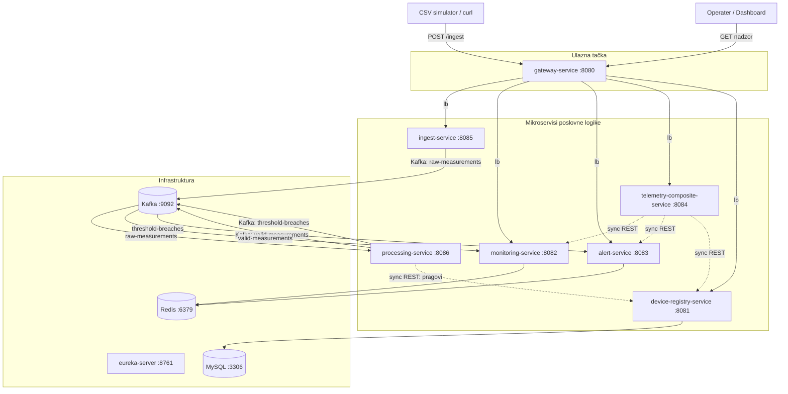
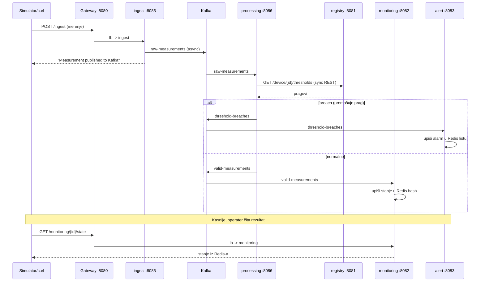

# Arhitektura i tok podataka

Ovaj dokument opisuje **poslovnu logiku**, **arhitekturu** i **tok podataka** distribuiranog IoT sistema za nadzor telemetrije u realnom vremenu. Sistem je mikroservisni, zasnovan na Spring Boot / Spring Cloud tehnologijama, kontejnerizovan preko Docker Compose-a.

---

## 1. Poslovna logika (šta sistem radi)

IoT uređaji (senzori) šalju merenja okoline — temperatura, vlažnost, CO, LPG, dim, svetlo, pokret. Sistem te podatke:

1. **Prima** (ingest) i objavljuje u tok događaja.
2. **Obrađuje** — proverava da li merenje premašuje **prag alarma** definisan **po uređaju**.
3. **Rutira** — normalna merenja idu u „živo stanje", a prekoračenja u „alarme".
4. **Servira** — operater/dashboard čita trenutno stanje uređaja, listu alarma ili kompletan agregiran pregled.

Ključni poslovni koncept je **prag po uređaju**: kuhinja toleriše više CO i topline (kuvanje), spavaća soba je stroža na temperaturu. Isto merenje može biti alarm za jedan uređaj, a normalno za drugi.

---

## 2. Dijagram arhitekture



**Legenda:** pune strelice sa `Kafka:` = **asinhrona** komunikacija (poruke preko topica); isprekidane strelice `sync REST` = **sinhroni** REST poziv (pozivalac čeka odgovor). Svi servisi su registrovani na Eureka; `lb` označava load-balanced rutiranje kroz service discovery.

---

## 3. Kako se sistem pokreće

### 3.1. Preduslovi
- **Docker Desktop** (mora biti pokrenut)
- **Java 17** i **Gradle** (`gradlew` wrapper) — potrebni samo pri izmeni koda

### 3.2. Pokretanje jednom komandom
Iz root foldera projekta:
```bash
docker-compose up -d
```

Redosled (obezbeđen preko `depends_on` u `docker-compose.yml`):

1. **Infrastruktura prva** — `zookeeper` → `kafka`, plus `mysql`, `redis`, `eureka-server`.
2. **Mikroservisi** se dižu i **registruju na Eureka**.
3. **Gateway** povezuje spoljne rute.

> `depends_on` čeka da se kontejner *pokrene*, ne da bude *spreman*. Zato servisi imaju ugrađeno ponovno pokušavanje registracije dok se Eureka/Kafka ne podignu.

### 3.3. Provera da je sve gore
```bash
docker-compose ps            # svi kontejneri "Up"
```
Eureka dashboard: <http://localhost:8761> — svi servisi treba da su `UP`.

### 3.4. Ponovna izgradnja posle izmene koda
Dockerfile **ne kompajlira** — kopira gotov `.jar`. Zato uvek dva koraka:
```bash
cd <servis> && ./gradlew bootJar          # napravi jar
cd .. && docker-compose up -d --build <servis>   # prepakuj sliku i restartuj
```

---

## 4. Infrastrukturne komponente

| Komponenta | Port | Uloga |
|---|---|---|
| **eureka-server** | 8761 | Service discovery — „imenik" gde se servisi prijavljuju i pronalaze jedni druge po imenu |
| **gateway-service** | 8080 | Spring Cloud Gateway — jedna ulazna tačka, rutira po URL putanji (`lb://` = load-balanced) |
| **kafka** + zookeeper | 9092 | Asinhrona komunikacija — topici `raw-measurements`, `valid-measurements`, `threshold-breaches` |
| **mysql** | 3306 | Trajno skladište registra uređaja i pragova (tabela `devices`) |
| **redis** | 6379 | Brzo in-memory skladište za živo stanje (hash) i alarme (lista) |

### Gateway rute

| Putanja | Cilj |
|---|---|
| `/ingest/**` | `lb://ingest-service` |
| `/monitoring/**` | `lb://monitoring-service` |
| `/alert/**` | `lb://alert-service` |
| `/telemetry/**` | `lb://telemetry-composite-service` |
| `/device/**` | `lb://device-registry-service` |

---

## 5. Mikroservisi poslovne logike

### 5.1. device-registry-service (:8081) — Registar uređaja
- **Uloga:** izvor istine o uređajima i njihovim pragovima alarma.
- **Skladište:** MySQL (tabela `devices`: `device_id`, `name`, `location`, `type`, `co_threshold`, `temp_threshold`).
- **API:**
  - `GET /device/{id}` — podaci o uređaju
  - `GET /device/{id}/thresholds` — pragovi za uređaj *(poziva ga processing-service)*
  - `POST /device` — registruj uređaj
- Na startu `DataInitializer` seje 3 uređaja sa pragovima.

### 5.2. ingest-service (:8085) — Prijem merenja
- **Uloga:** ulazna kapija za telemetriju.
- **Kako radi:** `POST /ingest` primi JSON i preko **`StreamBridge`** objavi na Kafka topic `raw-measurements`. Ne validira ništa (razdvajanje odgovornosti).
- **Sinhroni ulaz (REST) → asinhroni izlaz (Kafka).**

### 5.3. processing-service (:8086) — Validacija i rutiranje ⭐
- **Uloga:** mozak pipeline-a; odlučuje da li je merenje alarm.
- **Kako radi:** Spring Cloud Stream **`Function`** `processRawMeasurement` čita sa `raw-measurements`:
  1. Izvuče `deviceId`, `co`, `temperature`.
  2. **Sinhrono** pozove `device-registry` (`GET /device/{id}/thresholds`) preko **load-balanced RestClient-a** kroz Eureka. Pragove kešira; ako registry padne, koristi podrazumevane (CO > 0.01, Temp > 40).
  3. `breach = co > coThreshold || temp > tempThreshold`.
  4. `breach` → topic `threshold-breaches`, inače → `valid-measurements`.
- **Jedini servis koji kombinuje asinhronu (Kafka) i sinhronu (REST) komunikaciju.**

### 5.4. monitoring-service (:8082) — Živo stanje
- **Uloga:** poslednje poznato stanje svakog uređaja.
- **Kako radi:**
  - Consumer `stateUpdater` čita sa `valid-measurements`, upisuje u Redis **hash** `device:state:{id}` (uvek prepiše prethodno).
  - `GET /monitoring/{id}/state` čita iz Redis-a; ako nema podataka → `NO_DATA`.

### 5.5. alert-service (:8083) — Životni ciklus alarma
- **Uloga:** kreira i čuva alarme.
- **Kako radi:**
  - Consumer `alertHandler` čita sa `threshold-breaches`, sklopi alarm (`alertId`, `type`, `status: ACTIVE`, `createdAt`, originalno merenje), **dodaje** u Redis **listu** `device:alerts:{id}` (`rightPush` — čuva istoriju).
  - `GET /alert/{id}` vraća sve alarme za uređaj.

### 5.6. telemetry-composite-service (:8084) — Agregator (Composite obrazac)
- **Uloga:** jedan poziv koji sklapa kompletnu sliku uređaja.
- **Kako radi:** `GET /telemetry/{id}` **sinhrono** pozove `device-registry` + `monitoring` + `alert` i spoji odgovore.

---

## 6. Tok podataka (end-to-end)



**Koraci ukratko:**
1. Klijent šalje merenje na `POST /ingest` (kroz Gateway).
2. `ingest` objavljuje na `raw-measurements` i odmah vraća odgovor (ne čeka obradu).
3. `processing` čita merenje, **sinhrono** povlači pragove iz `device-registry`.
4. Na osnovu pragova rutira: prekoračenje → `threshold-breaches`, normalno → `valid-measurements`.
5. `alert` upisuje alarm (Redis lista) / `monitoring` upisuje stanje (Redis hash).
6. Operater čita `GET /monitoring|/alert|/telemetry` — sinhroni upiti koji vraćaju podatke iz Redis-a/MySQL-a.

---

## 7. Tipovi komunikacije (zahtev specifikacije)

| Tip | Gde se koristi | Zašto tu |
|---|---|---|
| **Sinhrona (REST)** | klijent → Gateway → servisi; processing → registry; composite → 3 servisa | kada je potreban **odgovor odmah** (upit stanja, pragovi, agregacija) |
| **Asinhrona (Kafka)** | ingest → processing → monitoring / alert | kada servisi treba da budu **labavo spregnuti** i otporni — ako consumer padne, poruke čekaju u Kafki |

Ovakva podela je namerna: prijem i obrada telemetrije su tok velike propusnosti gde ne želimo da ingest čeka obradu (async), dok su upiti operatera i pribavljanje pragova zahtevi tipa „pitanje-odgovor" (sync).

---

## 8. Demonstracija pragova po uređaju

Isto merenje (`temperature = 37`) ima različit ishod zbog pragova po uređaju:

```bash
# Bedroom (prag temp 35) -> BREACH -> alert
curl -X POST http://localhost:8080/ingest -H "Content-Type: application/json" \
  -d '{"deviceId":"1c:bf:ce:15:ec:4d","temperature":37,"co":0.005}'
curl http://localhost:8083/alert/1c:bf:ce:15:ec:4d      # ima alarm

# Living Room (prag temp 40) -> OK -> monitoring
curl -X POST http://localhost:8080/ingest -H "Content-Type: application/json" \
  -d '{"deviceId":"b8:27:eb:bf:9d:51","temperature":37,"co":0.005}'
curl http://localhost:8082/monitoring/b8:27:eb:bf:9d:51/state   # breach: false
```

| Uređaj | Lokacija | Prag CO | Prag temperature |
|---|---|---|---|
| `b8:27:eb:bf:9d:51` | Living Room | > 0.01 | > 40°C |
| `00:0f:00:70:91:0a` | Kitchen | > 0.02 | > 45°C |
| `1c:bf:ce:15:ec:4d` | Bedroom | > 0.01 | > 35°C |
